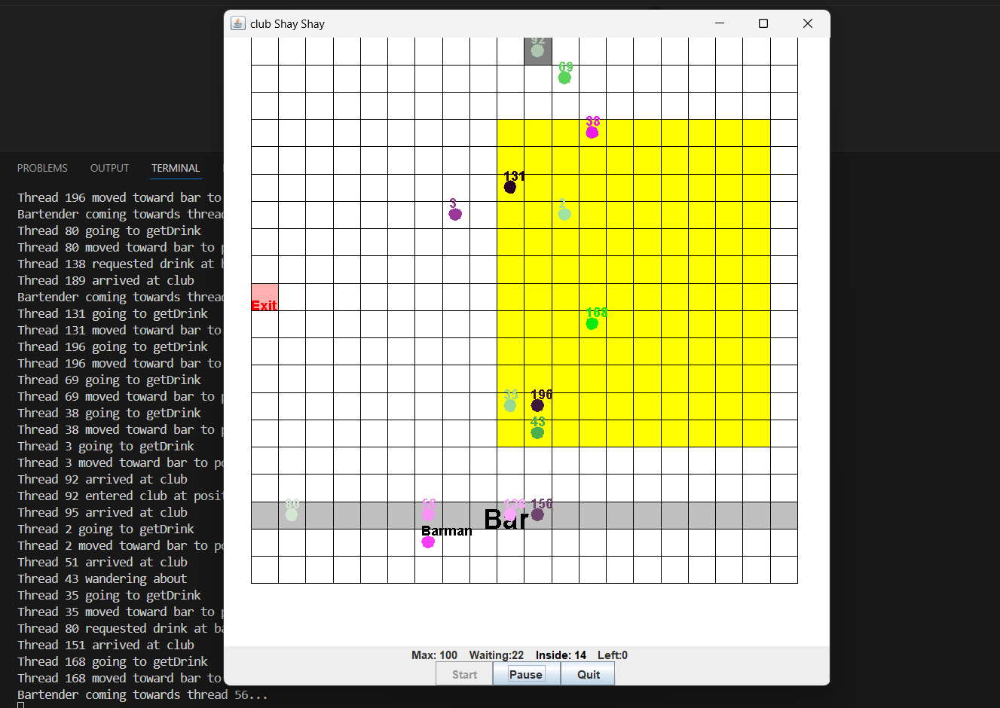

# 🎉 Club Simulation 🎉

Welcome to the **Club Simulation** project! This Java application simulates a vibrant nightclub environment where patrons enter, dance, visit the bar, and exit. Dive into the world of concurrency and graphical interfaces with this fun and interactive project!

## 📖 About the Project

The Club Simulation project is a multi-threaded Java application that simulates a nightclub environment. Patrons can arrive, move around the club, dance, visit the bar, and eventually leave. This project showcases the use of concurrency, graphical user interfaces, and synchronization in Java.



## ✨ Features

- **Real-time Simulation**: Watch patrons move around the club in real-time.
- **Graphical Interface**: Visually appealing GUI using Swing.
- **Concurrency**: Multi-threaded environment with synchronized actions.
- **Dynamic Updates**: Live updates of people entering, dancing, and leaving the club.

---

## 🚀 Installation

Follow these steps to get a local copy up and running:

1. **Clone the repo**
   ```sh
   git clone https://github.com/LuthoYRN/club-simulation.git
   ```
2. **Navigate to the project directory**
   ```sh
   cd club-simulation
   ```
3. **Compile the Java files**
   ```sh
   make
   ```
4. **Run the application**
   ```sh
   make run ARGS="<no.Of.ClubGoers> <gridX> <gridY> <maxOccupancy>"
   ```
   Example: 
   make run ARGS="10 20 20 100" will run 10 club goers in a 20 by 20 club grid with max occupancy of 100 club goers.
---

*Happy coding!* 🎵🕺💃